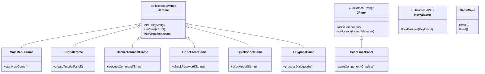

# CyberHack Simulator 🚀

> [!CAUTION]
> Este Proyecto es un proyecto de fin de módulo.

Un simulador de hacking en ambiente cyberpunk con múltiples minijuegos.

## Diagrama de Clases UML

## Características Principales

- 🖥️ **Terminal de hacking** estilo cyberpunk con efectos visuales
- 🎮 4 minijuegos de hacking diferentes:
  - Fuerza bruta de contraseñas
  - Scripting rápido bajo presión
  - Bypass de IA conversacional
- 💾 Guardado automático de partidas

## Requisitos

- Java 17 o superior
- Maven (para construcción)

## Licencia

MIT License - Ver [LICENSE](LICENSE) para más detalles.

---

⌨️ Desarrollado con ❤️ por Piratemajo para cyberhack
